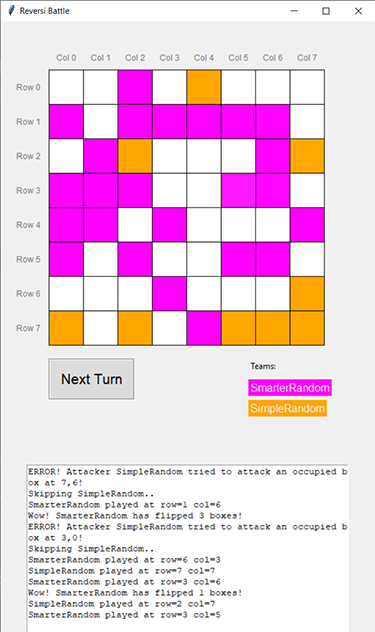

# Reversi Battle Game

Welcome to our Reversi battle! 
In this coding game, each team writes it's own bot to play Reversi against other bots. 

Here are some quick rules of the game, and a guide to help you implement your own player.

## Screenshot

## Game Rules

Reversi (also known as Othello) is a board game that involves strategy and tactics.  The game is played on an 8x8 grid board.
This game is a multiplayer version of Reversi, based on OOP Python.

Any number of teams can compete on a single board, where each team has its own color.
The board starts empty, and then players take turns conquering boxes with their team's color. 
In each turn, a team can choose any free box on the board.

If a team conquers a box which is positioned in such a way that it outflanks other teams (in a straight line - horizontal, vertical, or diagonal) this team will "flip" all of the boxes in between to it's color.
You can flip multiple opponent teams in one move.

The game ends when the board is full. The team with the most boxes of their color wins the game.

## This program

This program plays out the game with a graphic interface.
It supports any number of teams, where each team is created with a class definition.

To compete in the game, you need to implement a class that play turns.

## Requirements

Python with the `tkinter` library pre-installed (should be built-in on most Python setups)
. 

This should work on Windows and macOS (although `tkinter` has some compatibility issues on  M1 computers).

## Running the game

To run the game, run `main.py`.

## Implementing a Player

To implement a player, you will need to create a class that extends the `ReversiBotInterface` abstract class from the `bots` module. This class will need to have the following methods implemented:

- `__init__(self, name, preferred_color)`: 
  - This method will be used to initialize your bot. 
  - Here, you can set your bots name and preferred color by calling the super() with those values.

- `play_turn(self, grid)`:  
  - This method will be called when it's your bot's turn to play.

  - The method is passed the current state of the game grid (2D list of rows),
  where the values are either **None** for blank box or **team's name (str)** if it's occupied.
  - The `play_turn` method should return two values (packed in a tuple or a list) 
  indicating the row and column of the box your bot wants to conquer on the grid. 
  - Be careful – if you choose a box that is already conquered or is out of the grid, or raise an exception, 
  your bot will lose its turn.

You can see a simple template for a bot in **bots.py**.

---

That's it! You're ready to start implementing your own bot. Happy coding, and may the best bot win!

---
